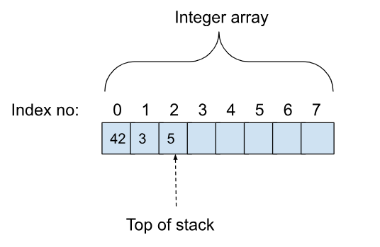

# Stack Computer

<!--- The assignment writeup is available [here](https://docs.google.com/document/d/1DYW5PhKKstGwk7F7TfmvbcBtNpa1lR5h8k2KiszKSiM/edit?usp=sharing). --->

## Motivation

The Java compiler translates code written in Java into a machine-independent byte-code that is interpreted at execution time by the Java Virtual Machine (JVM). The byte-code specifies a **stack computer** as the model for execution. For example, when you write Java code like this:


```
        // Java regular code
        public int add(int a, int b) {
           return a + b;
        }
```


The Java compiler translates it into this equivalent byte code:


```
        // Java byte-code equivalent
        public int add(int, int);
           Code:
              0: iload_1
              1: iload_2
              2: iadd
              3: ireturn
```


The byte-code says:


1. Load param1 and push it on the stack
2. Load param2 and push it on the stack
3. Pop param1 and param2 off the stack, add both values and push the result back on the stack
4. Return the value on the stack as the result of the function

The JVM uses a **stack computer** as a model because it is very flexible and can be implemented on many different types of actual machines. In this problem, we are going to implement our own stack computer that works like the JVM.


## StackComputer

The **StackComputer** class in StackComputer.java represents a stack computer. The stack holds integers and can be used to do simple arithmetic with integers. The stack is represented by an int array of some max size.

The figure below shows the int array of size 8 holding three values that have been pushed on: 42, 3 and 5. The last element pushed is 5, and the top of the stack is at index 2.




Here are the functions that define StackComputer:


* **public StackComputer(int maxsize)** -- Create a stack computer with a stack of maxsize. Realize this as an array of integers of maxsize.
* **public int[] getStack()** -- Return the array of ints that represents the stack. It should initially be all 0s.
* **public int size()** -- Return the number of elements on the stack. It should initially be 0.

Elements can be pushed and popped off the stack.


* **public void push(int value)** **throws StackException**-- Push an integer value on the stack. The stack's size increases by one. If the stack is at maximum size, it throws a StackException.
* **public int peek() throws StackException** -- Return (don't remove) the integer value at the top of the stack. The stack does not change in size. Throw a StackException if the stack is empty.
* **public int pop() throws StackException** -- Pop the integer value at the top of the stack and then return it. The stack's size decreases by 1.  Throw a StackException if the stack is empty.

These functions operate on the stack.


* **public void add() throws StackException**- Pop two values off the stack and adds them, and pushes the result back on the stack. Throw StackException if there are not enough values on the stack.
* **public void sub() throws StackException** - Pop two values off the stack and subtracts them, and pushes the result back on the stack. If arg1 is on top of the stack and arg2 is below it, then this gives arg2 - arg1. Throw StackException if there are not enough values on the stack.
* **public void mul() throws StackException** - Pop two values off the stack and multiplies them, and pushes the result back on the stack. Throw StackException if there are not enough values on the stack.
* **public void div() throws StackException** - Pop two values off the stack and divides them, and pushes the result back on the stack. If arg1 is on top of the stack and arg2 is below it, then this gives arg2 / arg1. Throw StackException if there are not enough values on the stack.

**StackException.java** is defined for you. It is a class that inherits from Exception. 

Your task is to implement all the functions listed above.


## Testing

There is a small test program in main. Run it with
```
	make run
```
Automated tests are in Test/StackComputerTest.java. You can check the tests by looking at the test files. 

You can run the tests by typing:
```
	make test
```

# Download the code
You want to download the provided code to your computer. There are skeleton placeholder files, as well as tests that you can run.

There are 3 ways you can do it.
- The first is to clone the repo using git. You can read all about that by completing the [Git and GitHub Fundamentals course](https://classroom.github.com/a/IKPSLbSi). This is great practice for your future software engineering classes, but not strictly necessary for this class.
- The second way is to use [GitHub Desktop](https://desktop.github.com/). The app is available for Windows and MacOS and very beginner friendly.
- The last way is click on the "Code" button, and download the zip file. This is probably the most straightforward way.

# Submitting
Submit your code by uploading it to this repo.

# Autograding
The autograder will run and check your answers against what is expected.
